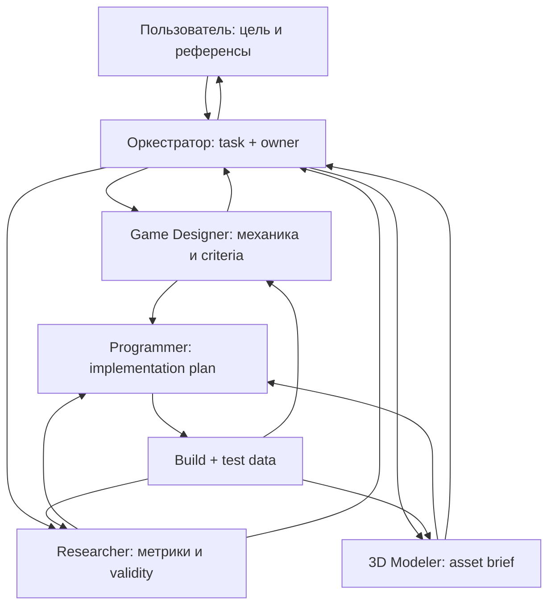

# Как запускать и координировать агентов DungeonTrace

## 1. Что создано

Пакет использует два дополняющих механизма Codex:

- `.codex/agents/*.toml` определяют именованных project-scoped subagents. Их вызывает главный агент-оркестратор.
- Вложенные `agents/<role>/AGENTS.md` задают роль отдельной полноценной сессии, если запустить Codex из соответствующей папки.

Корневой `AGENTS.md` содержит общие правила. Ролевой файл добавляет более узкие инструкции. Master-документ намеренно хранится отдельно: автоматически загружаемые инструкции должны оставаться короткими, а агент читает нужные разделы master-doc по задаче.

Официальные справки:

- Custom agents и subagents: <https://developers.openai.com/codex/subagents>
- Иерархия `AGENTS.md`: <https://developers.openai.com/codex/agent-configuration/agents-md>
- Git worktrees: <https://developers.openai.com/codex/app/worktrees>

## 2. Подключение к Unity-репозиторию

Скопируй в корень репозитория:

- `AGENTS.md`;
- `.codex/`;
- `agents/`;
- `coordination/`;
- `references/`;
- `templates/`;
- `prompts/`;
- `docs/DungeonTrace_CODEX_MASTER.md`.

Если в проекте уже есть `AGENTS.md` или `.codex/config.toml`, не заменяй их вслепую. Объедини правила, сохрани существующие настройки и проверь конфликты.

Первым коммитом зафиксируй agent pack отдельно от игрового кода. Это дает чистую точку возврата и позволяет всем worktree получить одинаковые инструкции.

## 3. Режим A — одна сессия с четырьмя subagents

Подходит для:

- анализа референсов;
- проверки плана;
- проектирования контракта до кода;
- ревью build/data;
- задач, где роли в основном читают и возвращают выводы.

### Запуск

1. Открой корень Unity-репозитория в Codex.
2. Создай новую сессию.
3. Вставь содержимое `prompts/ORCHESTRATOR_START.md`.
4. Явно попроси использовать custom agents по именам:
   - `dungeontrace_game_designer`;
   - `dungeontrace_researcher`;
   - `dungeontrace_3d_modeler`;
   - `dungeontrace_programmer`.
5. Попроси дождаться всех результатов и объединить их в один согласованный план.

В CLI команда `/agent` позволяет переключаться между активными agent threads и смотреть их состояние. Управлять агентами можно и обычной просьбой оркестратору: остановить, направить или продолжить конкретную роль.

### Безопасное правило записи

В этом режиме назначь **одного писателя игрового кода** — Programmer. Game Designer, Researcher и 3D Modeler сначала возвращают review или пишут только в собственный handoff/index. Оркестратор обновляет `TASK_BOARD.md` и `DECISIONS.md` после получения результатов.

Не проси четырех агентов одновременно редактировать одну сцену, prefab, ScriptableObject, `.meta`, `TASK_BOARD.md` или master-doc.

### Пример запроса

```text
Используй четыре project-scoped агента DungeonTrace. Пусть Game Designer разберет механику и сформирует acceptance criteria, Researcher определит события и риски валидности, 3D Modeler подготовит asset brief, а Programmer только после их результатов составит implementation plan и NEEDS_FROM_TEAM. Дождись всех агентов. На этом шаге не меняй Unity-код. Верни единый план с владельцами и зависимостями.
```

## 4. Режим B — четыре отдельные сессии в одной папке

Подходит только если задачи физически разделены и изменения малы.

Пример запуска из четырех терминалов:

```bash
codex --cd /absolute/path/to/repo/agents/game-designer
codex --cd /absolute/path/to/repo/agents/researcher
codex --cd /absolute/path/to/repo/agents/3d-modeler
codex --cd /absolute/path/to/repo/agents/programmer
```

Каждая сессия загрузит корневые правила и ролевой `AGENTS.md`, потому что Codex идет от Git root к текущей папке.

### Эксклюзивные зоны записи

| Сессия | Разрешенная запись по умолчанию |
|---|---|
| Game Designer | `docs/design/`, `references/game-design/`, `coordination/handoffs/game-designer.md` |
| Researcher | `docs/research/`, `coordination/METRICS_CONTRACT.md`, `coordination/handoffs/researcher.md` |
| 3D Modeler | согласованный `Assets/.../Art/`, `references/3d-modeler/`, `coordination/handoffs/modeler.md` |
| Programmer | `Assets/.../Scripts/`, `Assets/.../Tests/`, `coordination/NEEDS_FROM_TEAM.md`, `coordination/handoffs/programmer.md` |
| Orchestrator | `TASK_BOARD.md`, `DECISIONS.md`, интеграционные правки |

Даже с разделением путей Unity может автоматически затронуть `.meta`, prefab или scene. Перед параллельной записью назначь владельца каждого такого файла. Если агент видит чужое незавершенное изменение, он останавливается и создает handoff/blocker.

## 5. Режим C — отдельный Git worktree для каждой роли

Это рекомендуемый режим для реальной параллельной имплементации. Каждая роль получает собственную копию файлов и отдельную ветку; конфликты проявляются на контролируемой интеграции, а не во время записи.

### Вариант через Codex app

1. Проект должен быть Git-репозиторием, agent pack должен быть закоммичен.
2. Для новой роли создай чат и выбери `Worktree`.
3. Выбери одну и ту же стабильную starting branch.
4. В первом сообщении вставь соответствующий `prompts/*_START.md`.
5. Для долгоживущей роли создай permanent worktree и назови его по роли.

### Вариант через CLI и Git

Команды-пример; пути и base branch замени на свои:

```bash
git worktree add ../dungeontrace-gd -b agent/game-design main
git worktree add ../dungeontrace-research -b agent/research main
git worktree add ../dungeontrace-3d -b agent/3d-modeling main
git worktree add ../dungeontrace-code -b agent/programming main
```

Затем запусти сессии:

```bash
codex --cd /absolute/path/to/dungeontrace-gd/agents/game-designer
codex --cd /absolute/path/to/dungeontrace-research/agents/researcher
codex --cd /absolute/path/to/dungeontrace-3d/agents/3d-modeler
codex --cd /absolute/path/to/dungeontrace-code/agents/programmer
```

### Важное ограничение

Worktree не является общей live-папкой. Изменение одной роли становится доступно остальным после commit и интеграции. Поэтому коммуникация устроена так:

1. Роль завершает небольшой атомарный результат.
2. Обновляет собственный `coordination/handoffs/<role>.md`.
3. Делает commit в своей ветке.
4. Оркестратор проверяет и интегрирует commit/branch в integration branch.
5. Остальные роли обновляют свои worktree только после сообщения оркестратора.

Не давай двум worktree одну и ту же branch. Не проси агента самовольно merge/rebase общую ветку во время работы других ролей.

## 6. Рекомендуемый процесс взаимодействия



### Один цикл задачи

1. Пользователь дает цель, референс и ограничения.
2. Оркестратор создает `task_id`, владельца и зависимости.
3. Специалисты готовят contracts/briefs, не дублируя работу.
4. Programmer обновляет `NEEDS_FROM_TEAM.md` и план имплементации.
5. После получения необходимых входов Programmer реализует вертикальный срез.
6. Designer делает gameplay review, Researcher — telemetry QA, Modeler — art/integration QA.
7. Оркестратор фиксирует решение и закрывает задачу либо создает следующую итерацию.

## 7. Что именно передавать между ролями

| From → To | Обязательный пакет |
|---|---|
| GD → Programmer | механика, значения/диапазоны, state/edge cases, acceptance, telemetry request |
| GD → Modeler | функция, силуэт, размеры, читаемость, reference notes, priority |
| Researcher → Programmer | event trigger, fields/types, IDs, QA example, schema version |
| Programmer → Researcher | build/schema ID, sample JSONL/CSV, known data loss, test steps |
| Modeler → Programmer | source/export files, scale/pivot, materials, colliders, import settings |
| Programmer → GD | playable path, debug controls, changed parameters, known deviations |
| Любой → Оркестратор | результат, доказательства, риск, blocker, exact next action |

## 8. Первый реальный запуск

Рекомендуемый запрос оркестратору:

```text
Начинаем Milestone 0 проекта DungeonTrace. Используй четыре project-scoped агента. Сначала ничего не имплементируй. Game Designer должен запросить и классифицировать игровые референсы; Researcher — выделить основной исследовательский вопрос и черновик условий; 3D Modeler — проверить структуру папки визуальных референсов и создать initial asset list; Programmer — провести read-only инвентаризацию Unity-проекта и заполнить NEEDS_FROM_TEAM. Дождись всех, затем создай единый backlog P0/P1/P2 и предложи только первый вертикальный срез.
```

После review пользователя:

```text
Решение утверждено. Назначь Programmer единственным писателем Unity-кода для первого вертикального среза. Остальные роли работают в review/read-only режиме и пишут только в собственные handoff. Programmer обязан закрыть или явно оставить открытым каждый P0 need, реализовать минимальный путь и вернуть измененные файлы, тесты, telemetry evidence и шаги ручной проверки.
```

## 9. Чего не делать

- Не запускать параллельную имплементацию до contracts/owners.
- Не разрешать каждому агенту менять master-doc по своему усмотрению.
- Не смешивать научную гипотезу и баланс-решение в одной неразмеченной фразе.
- Не передавать 3D-моделеру задачу «сделай красиво» без gameplay purpose и бюджета.
- Не позволять Programmer молча выбирать отсутствующие параметры: пусть добавит need и предложит placeholder.
- Не анализировать данные до data-quality report и фиксации исключений.
- Не хранить пользовательские референсы или данные участников в публичной ветке без проверки прав и приватности.

## 10. Проверка, что настройка работает

Запусти новую сессию и попроси:

```text
Перечисли загруженные project instructions, доступных DungeonTrace custom agents, границы их ответственности и активные P0 needs. Не изменяй файлы.
```

Ожидаемый результат:

- агент видит корневой `AGENTS.md`;
- при запуске из `agents/programmer` видит также programmer rules;
- оркестратор называет четыре custom agents;
- активные P0 needs взяты из файла, а не придуманы;
- агент не начинает кодировать без пути к Unity-проекту и согласованных входов.

