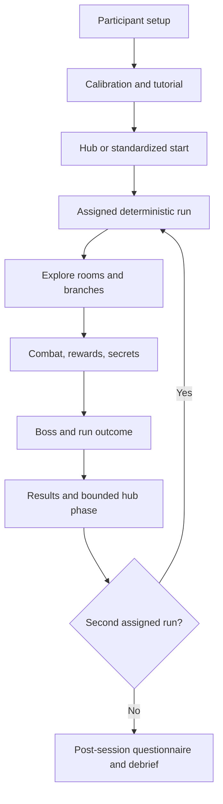
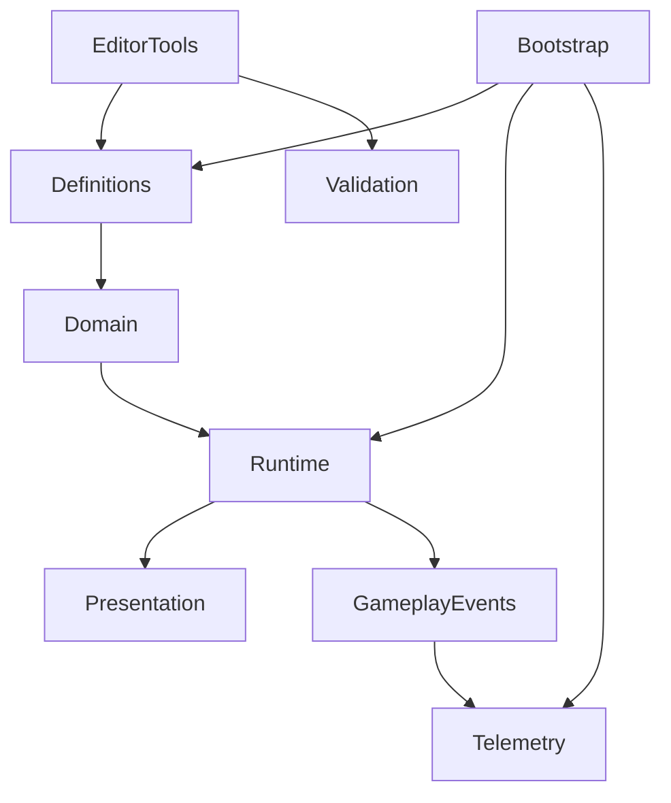
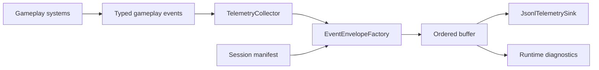
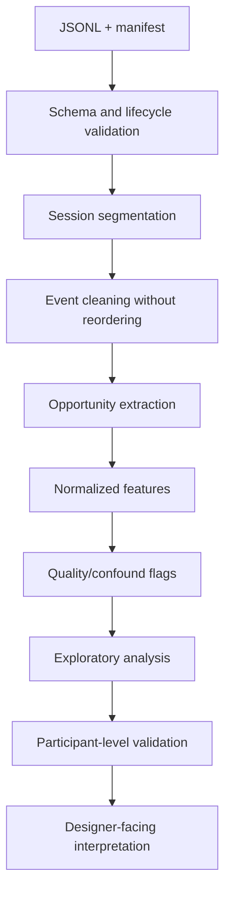

# DUNGEON TRACE — CODEX MASTER SPECIFICATION

> **Назначение файла:** единый источник требований для проектирования, реализации, проверки и подготовки к пользовательскому исследованию Unity-прототипа Dungeon Trace.
>
> **Рекомендуемое размещение:** корень Unity-репозитория. Для автоматического применения Codex можно переименовать файл в `AGENTS.md`. Если в проекте уже есть `AGENTS.md`, добавить в него обязательную ссылку: `Перед любой задачей прочитай DungeonTrace_CODEX_MASTER.md`.
>
> **Статус:** рабочая спецификация MVP. Любое изменение исследовательского протокола, структуры данных, seed policy или основного игрового цикла должно быть отражено здесь до main study.

---

## Содержание

1. [Контракт работы Codex](#1-контракт-работы-codex)
2. [Иерархия источников правды](#2-иерархия-источников-правды)
3. [Видение продукта](#3-видение-продукта)
4. [Научное назначение](#4-научное-назначение)
5. [Границы MVP](#5-границы-mvp)
6. [Игровой цикл](#6-игровой-цикл)
7. [Режимы сборки](#7-режимы-сборки)
8. [Контент MVP](#8-контент-mvp)
9. [First-person UX и доступность](#9-first-person-ux-и-доступность)
10. [Технический baseline Unity](#10-технический-baseline-unity)
11. [Архитектура и зависимости](#11-архитектура-и-зависимости)
12. [Сцены и жизненные циклы](#12-сцены-и-жизненные-циклы)
13. [Структура Assets и assemblies](#13-структура-assets-и-assemblies)
14. [Общие стандарты C#](#14-общие-стандарты-c)
15. [Definitions и stable IDs](#15-definitions-и-stable-ids)
16. [Game flow и конфигурация эксперимента](#16-game-flow-и-конфигурация-эксперимента)
17. [Игрок, ввод и камера](#17-игрок-ввод-и-камера)
18. [Комнаты и конструктор](#18-комнаты-и-конструктор)
19. [Генератор подземелья](#19-генератор-подземелья)
20. [Бой, здоровье и оружие](#20-бой-здоровье-и-оружие)
21. [Четыре типа врагов](#21-четыре-типа-врагов)
22. [Два босса](#22-два-босса)
23. [Предметы и экономика](#23-предметы-и-экономика)
24. [Секретные комнаты](#24-секретные-комнаты)
25. [Хаб и строительство](#25-хаб-и-строительство)
26. [UI, audio, VFX и accessibility](#26-ui-audio-vfx-и-accessibility)
27. [Телеметрическая архитектура](#27-телеметрическая-архитектура)
28. [Каталог событий](#28-каталог-событий)
29. [Метрики и признаки](#29-метрики-и-признаки)
30. [Протокол тестирования на людях](#30-протокол-тестирования-на-людях)
31. [Приватность, согласие и хранение](#31-приватность-согласие-и-хранение)
32. [Аналитический pipeline](#32-аналитический-pipeline)
33. [Стратегия тестирования](#33-стратегия-тестирования)
34. [Производительность и надёжность](#34-производительность-и-надёжность)
35. [Build и release process](#35-build-и-release-process)
36. [Пошаговый roadmap](#36-пошаговый-roadmap)
37. [Definition of Done](#37-definition-of-done)
38. [Риски и меры снижения](#38-риски-и-меры-снижения)
39. [Формат задач для Codex](#39-формат-задач-для-codex)
40. [Журнал реализации](#40-журнал-реализации)
41. [Приложения](#41-приложения)
42. [Исследовательская основа](#42-исследовательская-основа)

---

## 1. Контракт работы Codex

### 1.1 Главная цель

Codex должен построить небольшой, воспроизводимый и проверяемый FP3D-прототип, который:

- можно пройти за 10–15 минут;
- создаёт осмысленные поведенческие выборы;
- одинаково работает для участников в сравниваемых условиях;
- собирает валидную, упорядоченную и приватную телеметрию;
- позволяет провести pilot study и затем main study;
- остаётся достаточно простым для поддержки небольшой командой.

Качество исследования важнее количества контента. Codex не должен превращать прототип в коммерческую roguelite-игру с неконтролируемым scope.

### 1.2 Перед любой задачей

Codex обязан:

1. Прочитать этот файл полностью либо найти релевантные разделы через `rg`.
2. Найти ближайший `AGENTS.md` и применить более локальные инструкции.
3. Проверить фактическую Unity-версию в `ProjectSettings/ProjectVersion.txt`.
4. Проверить `Packages/manifest.json`, render pipeline, Input System и test assemblies.
5. Изучить существующие классы перед созданием новых.
6. Проверить `git status` и не перезаписывать пользовательские изменения.
7. Сформулировать наблюдаемый результат и acceptance criteria.
8. Определить влияние задачи на:
   - gameplay;
   - content version;
   - schema version;
   - seed determinism;
   - participant flow;
   - privacy;
   - primary research outcomes.
9. Реализовать минимальный цельный vertical slice.
10. Запустить доступные проверки и честно указать, что не запускалось.

### 1.3 Codex не имеет права без явного запроса

- обновлять Unity или packages;
- менять render pipeline;
- заменять Input System;
- менять исследовательские условия;
- включать adaptive difficulty в `ResearchObservation`;
- добавлять онлайн-отправку данных;
- собирать персональные данные;
- создавать multiplayer, live service или монетизацию;
- вводить jump, crouch, climbing или сложную вертикальную навигацию;
- создавать runtime procedural geometry;
- переписывать рабочую архитектуру ради стиля;
- массово перемещать assets;
- редактировать `.meta` вручную;
- создавать новые singletons без доказанного application-wide lifecycle;
- объявлять задачу проверенной, если Unity Editor/tests/build не запускались.

### 1.4 Принцип минимального изменения

Сначала найти существующего владельца поведения. Изменять минимальный набор файлов. Не совмещать feature, refactor, package upgrade и переезд папок в одной задаче.

### 1.5 Формат отчёта Codex

Каждая завершённая задача заканчивается блоком:

```text
Outcome:
Changed files:
Behavior:
Research impact:
content_version impact:
schema_version impact:
Checks run:
Checks not run:
Manual Unity steps:
Known risks / next step:
```

---

## 2. Иерархия источников правды

При конфликте требований использовать порядок:

1. Последнее прямое указание пользователя в текущей задаче.
2. Одобренный исследовательский протокол и consent materials.
3. Этот master-файл.
4. Ближайший локальный `AGENTS.md`.
5. Существующие публичные контракты кода и tests.
6. ScriptableObject definitions и build configuration.
7. Комментарии и устаревшие документы.

Если пункты 2–6 конфликтуют и выбор влияет на исследование, Codex останавливается и задаёт один конкретный вопрос.

---

## 3. Видение продукта

### 3.1 High concept

**Dungeon Trace** — короткая одиночная first-person 3D roguelite-игра в духе комнатной структуры The Binding of Isaac, но без копирования его визуального стиля и конкретных механик. Подземелье собирается из проверенных room prefabs по назначенному seed. Игрок находит оружие и предметы, сражается с четырьмя архетипами врагов и одним из двух боссов, исследует optional branches и секреты, получает валюту и расходует её в личном хабе.

### 3.2 Игровые столпы

1. **Читаемый бой от первого лица.** Угрозы имеют visual/audio telegraph и не наказывают игрока мгновенно из-за ограниченного FOV.
2. **Осмысленное исследование.** Ветви, секреты и подсказки создают выбор, но не блокируют победу.
3. **Короткая воспроизводимая сессия.** Seed и content version полностью описывают игровые возможности.
4. **Наблюдаемое поведение.** Игра создаёт действия, которые можно корректно нормализовать и анализировать.
5. **Контролируемая персонализация.** Хаб позволяет тратить валюту и выражать предпочтения без неконтролируемого влияния на сравниваемые забеги.

### 3.3 Целевая платформа

- PC;
- keyboard/mouse как основное исследовательское условие;
- gamepad допускается только как отдельно маркированное условие или covariate;
- offline-first;
- один локальный участник;
- placeholder/low-poly art допустим для MVP;
- стабильность frame pacing важнее визуальной сложности.

### 3.4 Длительность

- Tutorial/calibration: 3–5 минут.
- Run 1: 10–12 минут.
- Run 2: 10–12 минут.
- Hub: 3–5 минут.
- Pre/post questions: 5–10 минут.
- Общая целевая продолжительность исследования: 35–45 минут без учёта consent и организационного времени.

---

## 4. Научное назначение

### 4.1 Общая цель

Исследовать, насколько игровая телеметрия может описывать устойчивые поведенческие тенденции игрока и связывать их с мотивационными профилями и design preferences, не подменяя мотивацию навыком и не делая вывод по одному действию.

### 4.2 Объект и предмет

- **Объект:** поведение игроков в цифровых играх.
- **Предмет:** методы сбора, нормализации и анализа игровой телеметрии для выявления поведенческих паттернов, устойчивых профилей и связей с мотивационными моделями.

### 4.3 Рабочие исследовательские вопросы

- **RQ1:** Какие нормализованные игровые признаки устойчиво различаются между участниками?
- **RQ2:** Насколько признаки одного участника стабильны между двумя сбалансированными seeds?
- **RQ3:** Какие exploration, combat, resource и hub-признаки связаны с self-report мотивациями?
- **RQ4:** Улучшает ли учёт opportunities, skill и prior FPS experience интерпретируемость профиля?
- **RQ5:** Можно ли представить игрока continuous profile vector вместо жёсткой единственной категории?

### 4.4 Рабочие гипотезы

- Нормализованные ratios стабильнее абсолютных counts.
- Exploration profile должен учитывать доступные branches, secrets и время.
- Combat accuracy и clear time нельзя автоматически считать мотивационными признаками: это также skill/confounds.
- Профили будут смешанными; уверенность и top-2 gap информативнее forced single label.
- Сходные тенденции между seeds надёжнее, чем сильный результат в одном run.

### 4.5 Что игра не должна доказывать

- Что один игровой поступок раскрывает тип личности.
- Что Bartle/Hexad полностью объясняют поведение.
- Что корреляция означает причинность.
- Что поведение в одном FP3D-прототипе автоматически game-agnostic.
- Что ML-классификатор валиден без независимой выборки и participant-level split.

---

## 5. Границы MVP

### 5.1 Входит в MVP

- FP3D CharacterController.
- Mouse look, interaction ray, dash.
- 12–16 проверенных room prefabs.
- Детерминированный graph generator.
- Room constructor/validator.
- 4 оружия.
- 4 enemy archetypes.
- 2 bosses.
- 12 пассивных предметов.
- 3 consumables.
- 0–2 secret rooms.
- Shop/reward/choice/elite rooms.
- Fixed-slot hub.
- Локальное сохранение профиля.
- JSONL telemetry и session manifest.
- Research setup, counterbalancing и validator.
- EditMode/PlayMode/content/data tests.

### 5.2 Не входит в MVP

- Multiplayer.
- Online account.
- Cloud save.
- Remote telemetry upload.
- Live dashboard.
- Real-time ML inference.
- Dynamic difficulty в main study.
- Полностью процедурная геометрия.
- Несколько биомов.
- Сложный narrative campaign.
- Crafting.
- Inventory grid.
- Physics placement в хабе.
- Jump/crouch/climbing.
- Открытый мир.
- Monetization.

### 5.3 Правило scope

Новая функция входит в MVP только если она:

1. нужна для основного игрового цикла;
2. нужна для конкретного исследовательского вопроса;
3. нужна для безопасности/доступности участника;
4. исправляет blocker или data-quality risk.

Во всех остальных случаях — backlog после MVP.

---

## 6. Игровой цикл



### 6.1 Run flow

1. `ExperimentManager` загружает `SessionConfig`.
2. `RunController` получает assigned seed, boss, condition и standardized profile.
3. Генератор строит pure graph.
4. Validator подтверждает достижимость и budgets.
5. Assembler создаёт prefabs и соединяет sockets.
6. Игрок проходит основной путь, optional branch и возможные secrets.
7. Boss room завершает run.
8. `run_end` фиксирует outcome до загрузки Results.
9. Reward/currency применяется idempotently.
10. Следующий run получает назначенный counterbalanced seed.

### 6.2 Победа и поражение

- Победа: boss defeated и terminal reward/outcome зафиксированы.
- Поражение: health игрока достигает 0.
- В Research Mode разрешён один быстрый retry того же seed, если это предусмотрено протоколом.
- Retry не должен менять assigned content и не должен смешиваться с новым run ID.
- Причина завершения обязательна: `victory`, `death`, `withdrawal`, `technical_abort`, `timeout`, `researcher_stop`.

---

## 7. Режимы сборки

### 7.1 ResearchObservation

Главный режим main study:

- фиксированные правила;
- assigned seed order;
- standardized profile;
- adaptation отключена;
- FOV 90°;
- head bob off;
- camera shake off;
- dynamic FOV off;
- settings и performance записываются;
- debug UI и cheats недоступны;
- данные сохраняются локально;
- gameplay не зависит от telemetry sink.

### 7.2 Pilot

Для проверки:

- понятности управления;
- seed comparability;
- сложности;
- session duration;
- motion discomfort;
- event completeness;
- human-readable protocol.

Баланс может меняться между pilot builds, но build/content/schema version обязаны различаться.

### 7.3 Sandbox

Для разработки:

- выбор seed;
- выбор room/weapon/item/enemy/boss;
- teleport;
- immortality;
- ускорение времени;
- event viewer;
- validation overlay;
- export debug report.

Sandbox events маркируются `mode=Sandbox` и никогда не объединяются с pilot/main-study data.

### 7.4 Обычный Play Mode

Допускается для ручной разработки без participant flow. Такая сессия маркируется developer/test mode и не считается исследовательской.

---

## 8. Контент MVP

### 8.1 Структура одного подземелья

| Компонент | Количество | Правило |
| --- | ---: | --- |
| Start room | 1 | безопасный spawn и orientation |
| Combat rooms | 4–5 | ранние, средние и поздняя по budget |
| Choice room | 1 | читаемый выбор main/optional path |
| Treasure или Shop | 1 | гарантированно до boss |
| Elite | 0–1 | всегда optional, награда известна |
| Secret | 0–2 | не требуется для победы |
| Boss | 1 | назначается SessionConfig |

### 8.2 Preset rooms

- Start: 1.
- Combat: 6.
- Choice: 2.
- Treasure: 2.
- Shop: 1.
- Elite: 2.
- Secret: 2.
- Boss: 2.

Допускается начать vertical slice с меньшего количества, но main-study content lock требует полного набора либо документированного сокращения.

### 8.3 Оружие

| ID | Название | Механика | Trade-off | Ключевые данные |
| --- | --- | --- | --- | --- |
| `pulse_pistol` | Pulse Pistol | точный semi-auto hitscan | средний DPS | accuracy, rhythm, aim error |
| `scatter_blaster` | Scatter Blaster | 6 pellets, falloff | требует сближения | distance, pellet ratio, exposure |
| `arc_rifle` | Arc Rifle | charged penetrating ray | медленнее движение при charge | dwell, cancel, multi-hit |
| `orb_launcher` | Orb Launcher | slow projectile + small AOE | prediction вместо direct aim | lead, splash, area denial |

### 8.4 Враги

| ID | Роль | Основные состояния |
| --- | --- | --- |
| `pursuer` | постоянное давление ближнего боя | Idle, Chase, Windup, Attack, Recover |
| `spitter` | дальняя угроза и dodge check | Reposition, AcquireLoS, Aim, Fire, Cooldown |
| `charger` | telegraphed burst risk | Telegraph, Charge, Stunned |
| `warder` | меняет target priority | SeekAlly, Shield/Zone, Retreat |

### 8.5 Боссы

- **The Warden:** frontal volleys, sweep с safe sector, summon Pursuer, charge.
- **The Hoarder:** блокирует cover, создаёт real/decoy rewards, hazards, summon Warder.

### 8.6 Пассивные предметы

| ID | Эффект | Цена/ограничение | Аналитический смысл |
| --- | --- | --- | --- |
| `glass_sigil` | +35% damage | -25% max health | risk/mastery |
| `duelist_seal` | +20% damage до первого hit в комнате | сброс после hit | precision |
| `momentum_core` | speed stack за fast clear, max 3 | потеря при slow room | pace |
| `trial_crown` | double elite reward | elite +15% health | challenge |
| `surveyor_compass` | слабый pulse рядом с secret | без точной позиции | secret search |
| `cartographer_lens` | показывает тип соседней комнаты | без reward reveal | information |
| `echo_key` | открывает optional sealed door | одно применение | autonomy |
| `long_route_charm` | +20% reward после branch | нет бонуса main path | exploration |
| `coin_magnet` | притягивает currency | нет combat bonus | convenience |
| `bargain_charm` | shop -25% | damage -8% | economy trade-off |
| `ricochet_prism` | первый projectile ricochet | direct damage -12% | experimentation |
| `volatile_chamber` | каждый 6-й shot создаёт explosion | немного больше spread | timing |

### 8.7 Consumables

- `repair_kit`: +30 health, максимум 1.
- `reroll_token`: заменяет две offers, один reroll на altar.
- `skeleton_key`: открывает secret/locked reward door, расходуется.

---

## 9. First-person UX и доступность

### 9.1 Базовые параметры

| Параметр | Значение MVP |
| --- | --- |
| Health | 100 |
| Move speed | 5.0 m/s |
| Strafe multiplier | 0.9 |
| Camera height | 1.65 m |
| Research FOV | 90° |
| Pitch | -80°..+80° |
| Dash cooldown | 1.2 s |
| Dash invulnerability | 0.18 s |
| Interaction distance | 2.2 m |
| Weapon slots | 2 |
| Jump/crouch | отсутствуют |

Все значения должны находиться в versioned config/definitions, а не быть разбросаны по scripts.

### 9.2 Comfort invariants

- Нет forced camera rotation.
- Нет gameplay camera shake в Research Mode.
- Нет head bob в Research Mode.
- Нет FOV kick.
- Нет teleport игрока без fade/debug context.
- Dash не меняет FOV и не наклоняет горизонт.
- Меню pause освобождает cursor.
- Потеря focus автоматически ставит игру на pause либо фиксирует approved behavior.
- Чувствительность выбирается до run и фиксируется в manifest.
- Invert Y поддерживается и фиксируется.
- Reticle имеет достаточный contrast.
- Цвет не является единственным каналом telegraph.

### 9.3 Угрозы вне поля зрения

Любая атака, которая может начаться вне текущего FOV, должна иметь хотя бы два сигнала из списка:

- spatial audio;
- directional indicator;
- minimum windup;
- visible trajectory/ground marker;
- safe-entry grace period;
- ограничение spawn angle/distance.

### 9.4 Accessibility MVP

- sensitivity;
- invert Y;
- master/music/SFX volume;
- subtitles или текстовые prompts для tutorial;
- reticle visibility;
- reduced motion всегда активен в Research Mode;
- pause/withdrawal доступен в любой момент;
- controls screen;
- remapping, если текущий Input System workflow позволяет без риска scope; иначе документировать fixed mapping.

---

## 10. Технический baseline Unity

- Unity: зафиксированная командой Unity 6 LTS/фактическая версия проекта.
- Render pipeline: URP, если уже выбран проектом.
- Input: Unity Input System.
- Navigation: NavMesh.
- Player movement: CharacterController.
- Content data: ScriptableObject definitions.
- Tests: Unity Test Framework, EditMode + PlayMode.
- Telemetry: local JSON Lines + manifest.
- Save: versioned local profile DTO.
- Source control: Git; `.meta` включены, generated folders исключены.

Codex обязан читать фактический проект и не устанавливать пакет только потому, что он указан здесь. Если пакет отсутствует и нужен, сначала описать необходимость и минимальное изменение.

### 10.1 Input actions

- `Move`
- `Look`
- `Fire`
- `AltFire`
- `Dash`
- `Interact`
- `WeaponSelect`
- `Map` — только если действительно реализован
- `Pause`

Gameplay systems получают нормализованные команды через input adapter. Они не опрашивают клавиатуру напрямую.

### 10.2 Layers/tags

Предпочитать layers и components вместо string tags. Минимальные collision categories:

- Player;
- Enemy;
- World;
- Interactable;
- ProjectilePlayer;
- ProjectileEnemy;
- Hitbox;
- Trigger/TelemetryZone;
- ViewModel, исключённый из gameplay ray.

Collision matrix документируется в project settings и проверяется PlayMode tests для критических взаимодействий.

---

## 11. Архитектура и зависимости



### 11.1 Слои

- **Definitions:** authored immutable ScriptableObjects.
- **Domain:** pure C# rules, graphs, budgets, damage math, modifiers, features.
- **Runtime:** Unity lifecycle, spawning, scene state, adapters.
- **Presentation:** camera viewmodel, UI, VFX, audio.
- **GameplayEvents:** typed immutable facts.
- **Telemetry:** mapping, envelope, sinks, flush, manifest.
- **EditorTools:** room constructor, validators, generators.
- **Tests:** отдельные EditMode/PlayMode/data suites.

### 11.2 Запрещённые зависимости

- Domain → `MonoBehaviour`.
- Domain → concrete JSON writer.
- Definitions → runtime mutable state.
- Telemetry → gameplay decision.
- Presentation → authoritative damage/reward state.
- Enemy/Boss → direct file IO.
- Room prefab → global scene search.
- UI → прямое изменение definitions.

### 11.3 Dependency strategy

Приоритет:

1. constructor injection для pure C#;
2. явный `Initialize` для composed Unity objects;
3. serialized references внутри prefab/scene boundary;
4. typed registries для definitions;
5. узкие interfaces.

Не использовать как стандартный способ связи:

- `FindObjectOfType`;
- `GameObject.Find`;
- `Resources.Load` по динамической строке;
- глобальный mutable service locator;
- string messages;
- новый singleton на каждый manager.

### 11.4 Gameplay events

Событие описывает уже произошедший факт:

- `RoomEntered`;
- `RoomCleared`;
- `ShotFired`;
- `DamageApplied`;
- `EnemyKilled`;
- `SecretRevealed`;
- `HubItemPlaced`.

Publisher владеет event; subscribers не могут его вызвать. Payload не содержит scene references при пересечении module boundary.

---

## 12. Сцены и жизненные циклы

| Scene | Содержимое | Lifetime |
| --- | --- | --- |
| `Bootstrap` | services, GameFlow, telemetry, audio, global UI | application/session |
| `ParticipantSetup` | consent gate, participant code, settings | session setup |
| `MainMenu` | Research/Pilot/Sandbox selection | replaceable |
| `Hub` | room, catalog, fixed slots, run terminal | between runs |
| `Dungeon` | empty shell + runtime rooms | one run |
| `Results` | neutral outcome and next step | post-run |
| `RoomAuthoring` | editor/test harness | never research flow |

### 12.1 Application lifecycle

`Boot → Setup → Menu/AssignedFlow → Hub → LoadingRun → Run → Results → Hub/NextRun → Survey → End`.

Переходы явные. Двойной click или повторный event не должен запускать две загрузки.

### 12.2 Persistent objects

`DontDestroyOnLoad` разрешён только для объектов с application/session lifetime. Scene-specific managers не сохраняются. Bootstrap проверяет дубликаты и fail-fast в development build.

---

## 13. Структура Assets и assemblies

```text
Assets/_Project/
  Art/
  Audio/
  Definitions/
    Rooms/
    Weapons/
    Enemies/
    Bosses/
    Items/
    Hub/
    Research/
  Prefabs/
    Player/
    Rooms/
    Weapons/
    Enemies/
    Bosses/
    Hub/
    UI/
  Scenes/
  Scripts/
    Bootstrap/
    Domain/
    Flow/
    Player/
    Dungeon/
    Combat/
    AI/
    Items/
    Hub/
    Telemetry/
    UI/
    Persistence/
  Editor/
  Tests/
    EditMode/
    PlayMode/
    TestAssets/
```

Это целевая модель. Codex не реорганизует существующий согласованный проект без отдельной задачи.

### 13.1 Assembly candidates

- `DungeonTrace.Definitions`
- `DungeonTrace.Domain`
- `DungeonTrace.Runtime`
- `DungeonTrace.Presentation`
- `DungeonTrace.Telemetry`
- `DungeonTrace.Editor`
- `DungeonTrace.Tests.EditMode`
- `DungeonTrace.Tests.PlayMode`

Не дробить assemblies механически на старте. Граница оправдана, если предотвращает нежелательную зависимость, отделяет Editor или ускоряет test compilation.

---

## 14. Общие стандарты C#

### 14.1 Naming

- Types/methods/properties/events: `PascalCase`.
- Private fields: `_camelCase`.
- Locals/parameters: `camelCase`.
- Interfaces: `IName`.
- Boolean: `IsAlive`, `CanFire`, `HasReward`.
- Events: завершённый факт — `RoomCleared`, `DamageApplied`.
- Stable IDs: lower snake case, например `combat_l_03`.

### 14.2 Inspector

```csharp
[SerializeField, Min(0f)] private float _cooldownSeconds = 0.25f;
public float CooldownSeconds => _cooldownSeconds;
```

- Нет public mutable fields без причины.
- `OnValidate` проверяет authored values, но не запускает gameplay side effects.
- При rename serialized field использовать `FormerlySerializedAs`.
- Не хранить runtime health/ammo в ScriptableObject asset.

### 14.3 Lifecycle

- `Awake`: owned references и local invariants.
- `OnEnable/OnDisable`: симметричные subscriptions.
- `Start`: взаимодействия после всех `Awake`.
- `Update`: input/presentation.
- `FixedUpdate`: только physics.
- `LateUpdate`: camera/viewmodel order.
- `OnDestroy`: cleanup lifetime resources.

Не полагаться на случайный порядок lifecycle между разными GameObjects.

### 14.4 Performance

- Нет LINQ/string/new collection в hot per-frame paths.
- Нет per-frame `Debug.Log`.
- Physics buffers переиспользуются при частых queries.
- Pooling вводится для projectiles/VFX после определения reset contract.
- Оптимизация подтверждается profiler.

### 14.5 Error handling

- Invalid required configuration даёт сообщение с asset/type/stable ID.
- Не использовать empty catch.
- Не заменять determinism failure случайным fallback.
- Telemetry IO error изолируется от gameplay.
- Development build может fail-fast; research build завершает session с technical marker там, где безопасно.

---

## 15. Definitions и stable IDs

### 15.1 Общий контракт definition

Каждый authored definition содержит:

- stable ID;
- display name отдельно;
- content version или связь с registry version;
- validation method/editor rule;
- только authored immutable values;
- references на prefabs/VFX/audio при необходимости.

Запрещено использовать в данных исследования:

- GameObject name;
- asset filename;
- array index;
- Unity instance ID;
- localized string;
- runtime hash без документированного стабильного алгоритма.

### 15.2 Registries

Definitions доступны через typed registries:

- `RoomRegistry`;
- `WeaponRegistry`;
- `EnemyRegistry`;
- `BossRegistry`;
- `ItemRegistry`;
- `HubCatalog`.

Registry проверяет null, duplicate ID и version compatibility до старта run.

### 15.3 Version rules

Повышать `content_version`, если меняются:

- geometry, sockets, spawn layout;
- weapon damage/rate/range/spread;
- enemy health/speed/telegraph/AI;
- boss attacks/phases;
- item effect/price;
- reward amounts;
- clue visibility;
- shop/hub opportunities;
- generation weights/budgets;
- tutorial, влияющий на поведение.

Повышать `schema_version`, если меняются:

- смысл event;
- trigger;
- required fields;
- units;
- ID semantics;
- lifecycle interpretation.

---

## 16. Game flow и конфигурация эксперимента

### 16.1 Основные классы

| Класс | Ответственность | Не должен делать |
| --- | --- | --- |
| `GameBootstrap` | composition root, startup validation | управлять combat |
| `GameFlowController` | состояния и scene transitions | строить dungeon |
| `ExperimentManager` | IDs, condition, seed order | online classify player |
| `RunController` | start/end/pause/outcome | писать JSON напрямую |
| `ResearchModePolicy` | фиксировать разрешённые settings | хранить player profile inference |
| `BuildMetadata` | build/content/schema identifiers | меняться во время session |

### 16.2 SessionConfig

Минимальные поля:

```text
participant_id
session_id
condition_id
mode
assigned_seed_order[]
assigned_boss_order[]
content_version
schema_version
build_id
protocol_version
consent_version
standardized_profile_id
allow_retry
sampling_config
```

Конфигурация валидируется до gameplay. Researcher видит assignment до старта. Participant не должен случайно изменить seed или mode.

### 16.3 Counterbalancing

- G1: Seed A → Seed B.
- G2: Seed B → Seed A.
- Boss assignment balanced либо одинаковый boss для primary comparison.
- Порядок хранится в manifest.
- Если participant прерывает session, не переназначать его данные другому участнику без отдельной процедуры.

---

## 17. Игрок, ввод и камера

### 17.1 Компоненты

- `PlayerInputAdapter` — Input Actions → commands.
- `FirstPersonMotor` — CharacterController movement, gravity, strafe, dash.
- `PlayerLookController` — body yaw, camera pitch, sensitivity, invert Y.
- `AimProvider` — camera ray, aim point, muzzle correction.
- `InteractionController` — center-screen ray, focus, `IInteractable`.
- `PlayerHealth` — health/damage/death events.
- `PlayerStateController` — active, paused, dead, disabled.

### 17.2 Motor invariants

- Нет jump/crouch/sprint в MVP.
- Move и look разделены.
- Movement frame-rate independent.
- Dash input direction based, без camera motion.
- Dash cooldown использует единый time source.
- Invulnerability window явно тестируется.
- Pause/death блокирует movement/fire/interact.
- Scene load не оставляет input subscription от уничтоженного объекта.

### 17.3 Aiming pipeline

1. Ray из gameplay camera через reticle.
2. Hit point или max-distance point.
3. Hitscan использует camera ray.
4. Projectile строит направление muzzle → aim point.
5. Near-muzzle obstruction корректирует target point.
6. Visual projectile начинается у muzzle.
7. Fire и resolution связываются `shot_id`.

Viewmodel находится на слое, исключённом из gameplay ray. Visual recoil не изменяет authoritative aim ray.

### 17.4 Interaction

- Общий `IInteractable`.
- Max distance 2.2 m.
- Focus enter/exit не создаёт purchase/action.
- Interaction prompt получает данные из объекта.
- Повторный click обрабатывается idempotently.
- Shop, item, secret entrance и hub используют один input action, но разные узкие commands.

---

## 18. Комнаты и конструктор

### 18.1 RoomDefinition

```text
room_id
content_version
prefab
room_type
difficulty_tier
weight
tags[]
socket_descriptors[]
encounter_options[]
telemetry_zone_descriptors[]
secret_definition?
expected_clear_time_range
first_person_validation_data
```

Не дублировать transform coordinates в definition, если authoritative transform находится в prefab component.

### 18.2 Prefab components

| Component | Назначение | Обязательная проверка |
| --- | --- | --- |
| `RoomRoot` | origin/bounds/ID link | pivot, scale, definition |
| `DoorSocket` | connection pose/type | grid, outward forward, no block |
| `PlayerEntry` | arrival pose | capsule/head clearance, valid view |
| `EnemySpawnPoint` | spawn and tags | NavMesh, radius, safe distance |
| `CoverMarker` | cover semantics | reachable/does not trap |
| `LoSMarker` | line-of-sight design | safe sector from entry |
| `RewardSpawnPoint` | reward/shop | reachable, no exit blocking |
| `TelemetryZone` | region/interest point | unique zone ID |
| `RoomBounds` | overlap/debug | contains gameplay geometry |

### 18.3 EditorWindow

Room constructor должен:

- создать room template;
- связать prefab и definition;
- показать найденные components;
- запускать validation;
- группировать error/warning/info;
- выделять проблемный GameObject;
- поддерживать batch validation;
- сохранять report для build gate;
- не auto-fix transform/ID, если это меняет intent.

### 18.4 Rule codes

- `ROOM_ID_DUPLICATE`
- `VERSION_MISMATCH`
- `SOCKET_OFF_GRID`
- `SOCKET_BLOCKED`
- `ENTRY_CAPSULE_BLOCKED`
- `ENTRY_HEAD_CLEARANCE`
- `ENTRY_LOOKS_AT_WALL`
- `SPAWN_TOO_CLOSE`
- `SPAWN_OFF_NAVMESH`
- `REWARD_UNREACHABLE`
- `ZONE_ID_DUPLICATE`
- `CLUE_NO_LOS`
- `BOUNDS_INVALID`

Errors блокируют research build. Warnings требуют documented override.

### 18.5 Room readiness checklist

- [ ] Stable ID уникален.
- [ ] Definition/prefab version совпадают.
- [ ] Sockets совместимы и свободны.
- [ ] Все entries безопасны.
- [ ] Camera не clipping.
- [ ] Все spawns валидны.
- [ ] Reward/exit reachable.
- [ ] Zones имеют IDs.
- [ ] Комната очищается каждым оружием.
- [ ] Нет softlock после pause/re-entry/death.
- [ ] Expected clear time соответствует tier.

---

## 19. Генератор подземелья

### 19.1 Разделение

- `DungeonGenerationConfig` — constraints.
- `DungeonGraphBuilder` — pure graph.
- `DungeonBudgetPlanner` — difficulty/opportunities.
- `RoomSelector` — definition choice.
- `DungeonAssembler` — prefab placement.
- `DungeonValidator` — graph/spatial checks.
- `GenerationReport` — chosen IDs/retries/failures.

### 19.2 Determinism

- Один run root seed.
- Named substreams: `graph`, `rooms`, `encounters`, `loot`, `boss`, `secrets`.
- Candidate lists сортируются по stable ID.
- Не использовать порядок dictionary/asset discovery.
- Cosmetic RNG не влияет на gameplay streams.
- Retry использует документированный derived seed.
- Original/derived seed и retry index записываются.

### 19.3 Graph constraints

- Start и Boss связаны main path.
- Reward/Shop доступна до Boss.
- Choice создаёт реальную ветвь.
- Elite optional.
- Secret не обязателен.
- Main path length и combat budget входят в target interval.
- Branch не соединяется обратно случайно, если loop не поддержан.
- Ни одна required room не isolated.

### 19.4 Spatial assembly

- Соединять только compatible socket types.
- Выравнивать position/rotation по socket transform.
- Проверять RoomBounds overlap.
- Дверь не должна блокироваться geometry/NavMesh.
- PlayerEntry выбирается относительно входного socket.
- Runtime instance получает stable `room_instance_id`, отдельно от `room_id`.

### 19.5 Generation tests

- Same seed/version → same graph/IDs.
- Перестановка registry input не меняет result.
- 1000 seeds проходят reachability/door checks.
- Invalid layout даёт deterministic retry.
- Boss/reward constraints всегда выполняются.
- Serialized generation report читается offline.

---

## 20. Бой, здоровье и оружие

### 20.1 Damage contracts

```text
IDamageable
DamageContext
DamageResult
HealthComponent
DamageType
DamageSource
```

`DamageContext` включает source ID, target ID, shot/projectile ID, base damage, hit point, direction, distance, damage type и timestamp context. `HealthComponent` не знает конкретное оружие.

### 20.2 Health invariants

- Health clamp 0..MaxHealth.
- Death event один раз.
- После смерти damage не выдаёт reward повторно.
- Heal не превышает max.
- Invulnerability проверяется до mutation.
- Boss/enemy/player используют общий контракт, но могут иметь разные policies.

### 20.3 WeaponDefinition

```text
weapon_id
fire_strategy
damage
fire_rate
range
spread
pellet_count
charge_time
projectile_speed
explosion_radius
movement_modifier
gameplay_prefab
viewmodel_prefab
audio_vfx_refs
```

### 20.4 WeaponController

- 2 slots.
- Equip/switch state machine.
- Fire и alt fire.
- Cooldown/time source.
- Pause/death guard.
- AimProvider dependency.
- Typed events.
- Gameplay и presentation разделены.

### 20.5 Реализация оружия

#### Pulse Pistol

- Semi-auto.
- Один camera-ray hitscan.
- Низкий visual recoil.
- Не зависит от automatic repeat rate OS/input.

#### Scatter Blaster

- 6 pellets.
- Seeded spread per shot для воспроизводимости/debug.
- Damage falloff.
- Один `shot_id`, несколько pellet results.

#### Arc Rifle

- Start charge, cancel, complete.
- Movement modifier while charging.
- Penetrating ray с ограничением targets/distance.
- Aim dwell измеряется отдельно.

#### Orb Launcher

- Slow projectile.
- Near-muzzle obstruction.
- Direct + splash policy без double-damage target.
- Pool reset очищает subscriptions/state.

### 20.6 Combat tests

- Cooldown frame independent.
- Camera ray and muzzle correction.
- World blocks shots.
- Viewmodel не блокирует.
- Death idempotent.
- Splash deduplicates target.
- Pause prevents fire.
- Switch cancels/handles charge по design.
- Every weapon clears every combat room.

---

## 21. Четыре типа врагов

### 21.1 Общая модель

- `EnemyDefinition` — authored values.
- `EnemyController` — lifecycle/state orchestration.
- Targeting, movement, attack и presentation отделены, если переиспользуются.
- NavMesh path failure безопасно переводит AI в recovery/reposition.
- Spawn grace period.
- Death unregisters encounter exactly once.
- AI events не пишут файлы напрямую.

### 21.2 Pursuer

- Chase по NavMesh.
- Minimum windup.
- Spatial sound до melee attack.
- Recover window.
- Не наносит hit через стену/слишком большую дистанцию.

### 21.3 Spitter

- Acquire LoS.
- Maintain range band.
- Slow readable projectile.
- Aim telegraph.
- Reposition при block/no path.

### 21.4 Charger

- Telegraph line/direction.
- Audio cue.
- Locked charge trajectory с ограниченной коррекцией или без неё.
- Collision rules для wall/player.
- Stunned после miss/collision.

### 21.5 Warder

- Ищет eligible ally.
- Shield или slowing zone видимы игроку.
- Buff имеет duration/cooldown.
- Один Warder не создаёт бесконечный shield loop.
- При отсутствии ally retreat/reposition.

### 21.6 AI fairness

- Нет silent instant attack вне FOV.
- Нет spawn ближе minimum distance.
- Telegraph duration versioned.
- Attack cooldown не зависит от frame rate.
- В ResearchObservation behaviour config фиксирован.
- Random choices используют encounter RNG stream.

---

## 22. Два босса

### 22.1 Общие требования

- `BossDefinition`.
- Stable boss/phase/attack IDs.
- Explicit state machine.
- Deterministic phase thresholds.
- Intro grace period.
- Boss UI не является authoritative health.
- Reward/outcome один раз.
- Boss assignment приходит из SessionConfig.

### 22.2 The Warden

Фазы используют:

- frontal volleys;
- sweep attack с обозначенным safe sector;
- summon Pursuer с hard cap;
- telegraphed charge;
- increased combination complexity во второй фазе без нечитабельной скорости.

Проверяет стрельбу в движении, чтение сигналов и дистанцию.

### 22.3 The Hoarder

Фазы используют:

- временное закрытие части cover;
- реальные и ложные reward props;
- visible hazard zones;
- summon Warder с hard cap;
- смену безопасных линий обзора.

Проверяет visual inspection, risk/reward и repositioning.

### 22.4 Boss tests

- Legal phase order.
- Telegraph before damage.
- Safe sector реально безопасен.
- Summon cap.
- Duplicate death blocked.
- Room/run completion once.
- Retry same seed preserves assignment.
- Pause/reload не softlock.

---

## 23. Предметы и экономика

### 23.1 Item system

- `ItemDefinition` содержит stable ID, effect descriptor, offer tags и presentation.
- Runtime modifiers не изменяют asset.
- Stacking/order/removal явно определены.
- Duplicate unique items исключены.
- Offers deterministic от loot stream.
- Offer set сохраняется вместе с выбором.

### 23.2 Modifier order

Документировать порядок, например:

1. Base stat.
2. Flat modifiers.
3. Additive percent.
4. Multiplicative modifiers.
5. Clamp.

Не менять порядок между content versions без version bump.

### 23.3 Currency

- Единый `CurrencyService`/wallet.
- Причина изменения обязательна.
- Atomic purchase.
- Balance не отрицательный.
- Reward idempotent.
- Run-earned и persistent currency различимы в events.
- Main-study standardized balance задаётся profile/config.

### 23.4 Offers

Событие выбора хранит:

- полный offer set;
- prices;
- affordability;
- reroll count;
- selected/skipped;
- current loadout;
- opportunity count.

---

## 24. Секретные комнаты

### 24.1 Правила

- 0–2 на run.
- Не required для victory.
- Не блокируют main path.
- Имеют indirect clue.
- Reward выдаётся один раз.
- Same seed → same opportunity.
- Clue читаема с высоты 1.65 m.

### 24.2 Components

- `SecretDefinition`.
- `SecretClue`.
- `SecretEntrance`.
- `SecretRevealController`.
- `SecretRewardPoint`.
- `TelemetryZone`.

### 24.3 Observation rule

`clue_observed` не создаётся от одного raycast frame. Минимум:

- distance within threshold;
- angle within threshold;
- line of sight;
- continuous dwell threshold;
- clue active and opportunity valid.

Пороговые значения versioned и записываются в config/data dictionary.

### 24.4 Reveal MVP

- Игрок замечает clue.
- Подходит к hidden entrance.
- Использует общий Interact.
- Entrance переходит ClosedHidden → Revealed → Open.
- Повторное interaction не дублирует reward/event.

Skeleton Key может открыть eligible entrance согласно отдельному documented rule.

---

## 25. Хаб и строительство

### 25.1 Назначение

Хаб создаёт наблюдаемое расходование валюты и выбор между functional/cosmetic options. Он не должен превращаться в сложную building sandbox.

### 25.2 Fixed-slot model

- `HubItemDefinition`.
- `HubSlot` со stable ID/category.
- `HubCatalog`.
- `HubBuildController`.
- Preview/place/replace/remove/cancel/undo.
- Save/load versioned profile.

### 25.3 Контент

- 8 cosmetics: carpet, lamp, plant, poster, wall color, small prop и т. п.
- 2 trophies: Warden/Hoarder.
- 3 starting modules: Heal, Reroll, +5 coins.
- 1 archive panel.

### 25.4 Research constraints

- Доступные items/slots фиксируются.
- Affordability сохраняется.
- Starting module входит в run config.
- Standardized test profile можно reset.
- Reset profile никогда не удаляет exported research logs.
- Main comparison либо контролирует hub bonuses, либо использует одинаковое standardized состояние.

---

## 26. UI, audio, VFX и accessibility

### 26.1 UI screens

- Participant Setup.
- Consent confirmation gate.
- Settings/calibration.
- Main Menu/mode selection для researcher builds.
- HUD: health, weapon, cooldown, currency, reticle, interaction.
- Pause с Resume/Withdraw/Settings.
- Results без мотивационных ярлыков.
- Hub catalog/build UI.
- Researcher assignment/status panel.

### 26.2 UI principles

- Не показывать предполагаемый player type участнику во время study.
- Не создавать social desirability bias формулировками.
- Results показывают нейтральные факты, если это разрешено протоколом.
- Debug and researcher controls недоступны participant.
- Ошибка telemetry не показывается как пугающий technical dump; researcher получает отдельный status.

### 26.3 Audio

- Spatial cues для off-screen threat.
- Отдельный telegraph cue per attack family.
- Audio source pooling/limits.
- Master/SFX/music settings.
- Audio не должен быть единственным сигналом для критического действия.

### 26.4 VFX

- Placeholder VFX допустимы.
- Hit feedback не закрывает target.
- Hazard boundary читаема.
- Research Mode исключает camera shake/flash extremes.
- Cosmetic randomness не влияет на physics/AI/events.

---

## 27. Телеметрическая архитектура

### 27.1 Принцип

Gameplay публикует typed semantic facts. Telemetry подписывается, создаёт data-only payload, добавляет envelope и пишет sink. Gameplay должен полностью работать с `NullTelemetrySink`.



### 27.2 Основные классы

- `TelemetryCollector`.
- `EventEnvelopeFactory`.
- `SequenceNumberProvider`.
- `IMonotonicClock`.
- `ITelemetrySink`.
- `JsonlTelemetrySink`.
- `NullTelemetrySink`.
- `TelemetryFlushController`.
- `SessionManifestWriter`.
- `TelemetryValidator`.
- `TelemetryExportService`.

### 27.3 Event envelope

Обязательные поля:

| Field | Type | Назначение |
| --- | --- | --- |
| `event_id` | GUID/string | deduplication |
| `event_name` | string | stable snake_case |
| `schema_version` | string/int | meaning/shape |
| `session_id` | string | session |
| `participant_id` | string | pseudonymous code |
| `run_id` | string/null | current run |
| `sequence_no` | long | strict order |
| `occurred_at_utc` | ISO-8601 | wall-clock correlation |
| `monotonic_ms` | long | duration/order |
| `build_id` | string | exact build |
| `content_version` | string | content/balance |
| `mode` | string | Research/Pilot/Sandbox |
| `condition_id` | string/null | assignment |
| `context` | object | seed/room/encounter |
| `payload` | object | event-specific data |

### 27.4 Storage

- Один JSONL на session.
- Один manifest на session.
- Append-only.
- Complete line writes.
- Flush примерно каждые 10 секунд.
- Flush after room, run end, pause/focus loss, quit.
- Incomplete session обнаруживается при следующем запуске.
- Recovery не переписывает raw events.
- Export отделён от mutable save profile.

### 27.5 Sampling

- Semantic events — по transition.
- `position_sample`/`view_sample` — стартово 4 Hz.
- `performance_sample` — стартово 1 Hz aggregates.
- Sampling rates находятся в config/manifest.
- Нет per-frame JSON events.
- Raw order сохраняется; filtering/compression выполняются offline.

---

## 28. Каталог событий

### 28.1 Session/settings

- `session_start`
- `session_end`
- `app_focus_changed`
- `settings_changed`
- `performance_sample`
- `telemetry_recovery`
- `participant_withdrawal`

### 28.2 Run/generation

- `run_configured`
- `run_start`
- `run_end`
- `retry_start`
- `dungeon_generated`
- `generation_retry`

### 28.3 Room/navigation

- `room_entered`
- `room_activated`
- `room_cleared`
- `room_exited`
- `branch_entered`
- `backtrack_detected`
- `position_sample`
- `view_sample`
- `telemetry_zone_entered`
- `telemetry_zone_exited`

### 28.4 Exploration/secrets

- `clue_observed`
- `secret_revealed`
- `secret_entered`
- `secret_reward_claimed`
- `interaction_completed`

### 28.5 Combat

- `weapon_equipped`
- `shot_fired`
- `shot_resolved`
- `projectile_hit`
- `damage_dealt`
- `damage_taken`
- `dodge_started`
- `enemy_spawned`
- `enemy_attack_started`
- `enemy_killed`
- `player_died`
- `boss_phase_started`
- `boss_attack_started`

### 28.6 Economy/items/hub

- `reward_granted`
- `currency_changed`
- `offer_presented`
- `offer_selected`
- `offer_skipped`
- `offer_rerolled`
- `item_acquired`
- `hub_item_previewed`
- `hub_upgrade_purchased`
- `hub_item_placed`
- `hub_item_removed`
- `hub_action_undone`
- `starting_module_selected`

### 28.7 Lifecycle rules

- `session_start` первый semantic event.
- Один terminal `session_end` либо recovery state.
- `run_start` только после `run_configured`.
- Один `run_end` на run ID.
- Room clear один раз.
- Shot fire/resolution связаны `shot_id`.
- Reward grant имеет idempotency key.
- Sequence строго возрастает.

---

## 29. Метрики и признаки

### 29.1 Exploration

- optional room ratio;
- secret discovery rate;
- clue observation rate;
- normalized path length;
- backtrack ratio;
- route entropy;
- room dwell distribution;
- view coverage;
- branch choice latency;
- main-path distance over time.

Нормализация: available branches, secrets, clues, play time, traversable path, seed, FOV, sensitivity.

### 29.2 Combat

- hit rate;
- pellet hit ratio;
- angular aim error;
- target acquisition latency;
- mean/median engagement distance;
- weapon usage share;
- dodge timing;
- damage taken per encounter;
- clear time;
- deaths;
- boss phase retries.

Контролировать: enemy composition, weapon availability, seed, prior FPS experience, input device, frame rate.

### 29.3 Resources

- spend ratio;
- save ratio;
- offer skip ratio;
- reroll use;
- purchase latency;
- risk/reward item selection;
- affordability-adjusted choice.

Нормализация: available/affordable offers, earned currency, current health/loadout.

### 29.4 Hub

- cosmetic/function purchase ratio;
- preview-to-purchase ratio;
- placement revisions;
- undo rate;
- slot coverage;
- starting module preference.

Нормализация: unlocked catalog, available slots, currency.

### 29.5 Skill/confounds

Следующие признаки не считать мотивацией автоматически:

- raw accuracy;
- aim error;
- clear time;
- deaths;
- tutorial errors;
- FPS familiarity;
- frame rate;
- sensitivity;
- input device;
- motion discomfort.

Их использовать как covariates или отдельный skill dimension.

### 29.6 Profile output

Предпочтительный output:

```text
exploration_tendency: value + uncertainty
combat_mastery_tendency: value + uncertainty
risk_tendency: value + uncertainty
resource_tendency: value + uncertainty
expression_tendency: value + uncertainty
cross_seed_stability: value
data_quality_flags[]
```

Не выдавать forced single label без обоснованного research requirement.

---

## 30. Протокол тестирования на людях

> Этот раздел — проектный baseline, а не замена требованиям университета, этического комитета или утверждённого consent form. Перед сбором реальных данных исследователь утверждает протокол в применимом порядке.

### 30.1 Этапы исследования

1. Recruitment/eligibility.
2. Information sheet и добровольное согласие.
3. Назначение pseudonymous participant code.
4. Pre-session questionnaire.
5. Settings calibration.
6. Tutorial.
7. Run 1.
8. Short discomfort/checkpoint question.
9. Run 2 с counterbalanced seed.
10. Hub phase.
11. Post-session questionnaire.
12. Debrief и напоминание о withdrawal/data policy.

### 30.2 Eligibility baseline

Определяется утверждённым протоколом. Минимально зафиксировать:

- adult/approved age range;
- informed consent;
- возможность использовать выбранное устройство ввода;
- prior FPS experience;
- корректированное зрение при необходимости;
- self-reported sensitivity to first-person motion, если это разрешено протоколом.

Не собирать медицинские данные сверх утверждённой необходимости.

### 30.3 Pre-session данные

- participant code;
- age band, если утверждено;
- general play frequency;
- prior FPS experience;
- familiarity with roguelites;
- input preference;
- optional motivation questionnaire/Hexad/Bartle согласно research plan;
- baseline discomfort 0–10.

Questionnaire хранится отдельно от raw gameplay logs и связывается только participant code.

### 30.4 Calibration/tutorial

- Выбрать sensitivity из ограниченного диапазона.
- Проверить invert Y.
- Объяснить move/look/fire/dash/interact/switch/pause.
- Дать безопасную тренировочную цель.
- Убедиться, что participant может остановиться в любой момент.
- Tutorial одинаков для всех compare conditions.
- Tutorial errors записываются как skill/confound.

### 30.5 Поведение исследователя

- Использовать standardized script.
- Не подсказывать secrets/optimal build.
- Не оценивать вслух performance.
- Не объяснять player types до окончания session.
- Отмечать только technical incidents и approved observations.
- При вопросе участника давать заранее утверждённый нейтральный ответ.

### 30.6 Stop rules

Session немедленно ставится на pause/завершается, если:

- participant просит остановиться;
- появляется выраженное головокружение, тошнота, дезориентация или eye strain;
- participant достигает утверждённого discomfort threshold;
- возникает technical failure, делающий condition несопоставимым;
- исследователь считает продолжение небезопасным.

Событие фиксирует нейтральную причину без медицинского диагноза. Участник не штрафуется и не обязан объяснять withdrawal.

### 30.7 Pilot study

Рекомендуемый диапазон: 12–20 полноценных pilot sessions либо до достижения заранее заданных критериев качества. Pilot не используется для подтверждающих выводов main study, если это не предусмотрено анализом.

Pilot проверяет:

- completion rate;
- duration;
- seed A/B comparability;
- boss comparability;
- control comprehension;
- motion discomfort;
- telemetry completeness;
- event cardinality;
- questionnaire clarity;
- researcher script;
- export/recovery.

### 30.8 Main study gate

Main study начинается только после:

- protocol/consent approval;
- content lock;
- build lock;
- schema lock;
- balanced seed pool;
- completed pilot review;
- data dictionary;
- analysis plan/preregistration, если применяется;
- clean-PC build test;
- backup/export rehearsal;
- researcher dry run.

Размер main-study выборки определяется power analysis, design и доступными ресурсами; не задаётся кодом.

---

## 31. Приватность, согласие и хранение

### 31.1 Разрешённые identifiers

- researcher-assigned participant code;
- random session ID;
- random run ID;
- stable content IDs.

### 31.2 Запрещено в gameplay logs

- имя;
- email;
- телефон;
- IP;
- OS username;
- device serial;
- account identifier;
- voice/video;
- free-text answer;
- полный локальный user path;
- questionnaire raw responses, если они не предусмотрены отдельным защищённым store.

### 31.3 Separation

- Re-identification key хранится отдельно.
- Questionnaire dataset отдельно.
- Gameplay JSONL отдельно.
- Export manifest не содержит identity mapping.
- Analysis joins выполняются по participant code в контролируемой среде.

### 31.4 Withdrawal

Процедура должна позволять найти и удалить данные по participant code в пределах утверждённой policy. Gameplay client не должен сам удалять exported logs через обычный profile reset.

### 31.5 Retention

Retention period, доступ, encryption, backup и deletion определяются утверждённым research data management plan. Codex не придумывает сроки и не встраивает их без решения исследователя.

---

## 32. Аналитический pipeline



### 32.1 Raw data principles

- Raw immutable.
- Processing repeatable.
- Pipeline versioned.
- Input hashes/checks recorded.
- No silent row deletion.
- Temporal order preserved.
- Missingness documented.

### 32.2 Validation

- Required envelope fields.
- Unique event ID.
- Monotonic sequence.
- Manifest/version agreement.
- Legal session/run/room lifecycle.
- Known stable IDs.
- Correlated shot events.
- Final flush/recovery marker.
- No PII patterns.

### 32.3 Dataset splitting

Все runs одного participant остаются в одном fold. Запрещён participant leakage между train/test. Seed и content versions stratify/control where appropriate.

### 32.4 Cross-seed stability

Оценивать:

- correlations/ICC по подходящим continuous features;
- absolute/relative differences;
- confidence intervals;
- rank stability;
- raw counts vs normalized ratios.

### 32.5 Motivation mapping

- Начинать с прозрачных correlations/regressions.
- Контролировать skill, seed, input device, prior experience.
- Не интерпретировать small-N exploratory result как подтверждённую классификацию.
- Использовать uncertainty и mixed profiles.
- ML вводить после достаточного sample/data quality.

---

## 33. Стратегия тестирования

### 33.1 EditMode

- graph determinism;
- budgets/constraints;
- unique IDs;
- damage/modifier math;
- offer determinism;
- serialization;
- telemetry schema/lifecycle;
- feature formulas;
- counterbalancing assignment.

### 33.2 PlayMode

- cursor/pause/focus;
- motor/look/dash;
- camera ray/muzzle correction;
- room state/doors;
- encounter clear;
- enemy/boss lifecycle;
- death/retry;
- secret reveal;
- hub transactions;
- telemetry flush on transitions.

### 33.3 Content batch

- every room validates;
- every room playable with every weapon;
- supported encounter completes;
- reward and exit reachable;
- stable IDs unique;
- 1000 generation seeds no softlock;
- main seed pool detailed report.

### 33.4 Build smoke

- clean PC without Editor;
- ParticipantSetup → two runs → hub → survey/end;
- local export path;
- Alt+F4 recovery;
- no debug tools in participant build;
- build ID visible researcher-side;
- profile reset safe.

### 33.5 Data QA

- synthetic session with known behavior;
- expected event counts/lifecycle;
- expected normalized features;
- corrupt line handling;
- missing terminal event recovery;
- participant-level split test;
- Sandbox exclusion.

### 33.6 Human pilot

- no hidden researcher help;
- controls understood;
- threats readable;
- discomfort monitored;
- time within range;
- both seeds comparable;
- data export complete.

---

## 34. Производительность и надёжность

### 34.1 Performance targets

Точные targets фиксируются для выбранного hardware. Минимальный принцип:

- стабильный frame pacing;
- отсутствие регулярных GC spikes;
- telemetry on/off не создаёт практически значимого gameplay difference;
- memory не растёт после двух runs;
- projectiles/VFX bounded;
- AI/path updates профилируются.

### 34.2 Performance telemetry

Сохранять aggregates:

- average/median frame time;
- percentile frame time, если доступно без excessive overhead;
- low-frame count;
- memory sample;
- active enemies/projectiles;
- room ID/context.

Не собирать hardware serials.

### 34.3 Reliability

- JSONL append.
- Bounded event buffer.
- Periodic flush.
- Atomic mutable save replace.
- Recovery marker.
- Idempotent terminal/reward operations.
- Build/config validation before session.

---

## 35. Build и release process

### 35.1 Build types

- Developer Sandbox.
- Internal QA.
- Pilot.
- Main Study.

Каждый имеет уникальный `build_id`. Pilot и Main Study используют отдельные export directories.

### 35.2 Pre-build gates

- Compile no new relevant warnings.
- EditMode pass.
- PlayMode critical pass.
- All content validation pass.
- 1000-seed batch pass.
- Telemetry schema pass.
- No PII/config secrets.
- Correct mode/policy.
- Debug cheats removed/locked.
- Content/schema/build version set.

### 35.3 Main-study lock

После lock любое изменение gameplay/content/schema требует:

1. новый version/build ID;
2. impact review;
3. regression tests;
4. seed rebalance, если affected;
5. решение о совместимости уже собранных данных.

### 35.4 Command-line tests

Codex должен найти реальный Unity executable и использовать batchmode только если доступен. Не придумывать путь. Общая форма:

```text
Unity -batchmode -quit -projectPath <PROJECT> -runTests -testPlatform EditMode -testResults <RESULT_XML>
Unity -batchmode -quit -projectPath <PROJECT> -runTests -testPlatform PlayMode -testResults <RESULT_XML>
```

Если Unity CLI недоступен, Codex выполняет статические проверки и даёт точные ручные шаги.

---

## 36. Пошаговый roadmap

### Phase 0 — Repository audit и research spec

- [ ] Unity/packages/render/input verified.
- [ ] Existing architecture mapped.
- [ ] RQ/protocol/data dictionary draft.
- [ ] Build/content/schema version policy.
- [ ] Git ignore and asset rules.

**Gate:** согласованы MVP и исследовательские ограничения.

### Phase 1 — Foundation + FP vertical slice

- [ ] GameBootstrap.
- [ ] GameFlowController.
- [ ] SessionConfig/ResearchModePolicy skeleton.
- [ ] FirstPersonMotor.
- [ ] PlayerLookController.
- [ ] AimProvider.
- [ ] InteractionController.
- [ ] Health.
- [ ] Test room.
- [ ] Basic tests.

**Gate:** игрок безопасно двигается, смотрит, взаимодействует и проходит smoke test.

### Phase 2 — Rooms/editor

- [ ] RoomDefinition.
- [ ] Authoring components.
- [ ] EditorWindow.
- [ ] Validation rules.
- [ ] Initial room templates.

**Gate:** дизайнер создаёт и валидирует room без изменения runtime code.

### Phase 3 — Deterministic dungeon

- [ ] Graph builder.
- [ ] Budgets.
- [ ] Assembler.
- [ ] Validator.
- [ ] Derived seed retry.
- [ ] 1000-seed test.

**Gate:** same seed/version воспроизводим, обязательный path reachable.

### Phase 4 — Weapons/combat

- [ ] Damage contracts.
- [ ] Weapon definitions.
- [ ] Four weapons.
- [ ] Shot correlation events.
- [ ] Combat tests.

**Gate:** каждое оружие очищает все combat rooms без softlock.

### Phase 5 — Enemies/encounters

- [ ] Pursuer.
- [ ] Spitter.
- [ ] Charger.
- [ ] Warder.
- [ ] EncounterDirector.
- [ ] Fairness tests.

**Gate:** room lifecycle корректен, угрозы читаемы в FP.

### Phase 6 — Bosses/secrets/items

- [ ] Warden.
- [ ] Hoarder.
- [ ] Secret flow.
- [ ] 12 passive items.
- [ ] Consumables/offers/shop.

**Gate:** полный run от start до boss playable.

### Phase 7 — Hub/persistence

- [ ] Wallet/profile.
- [ ] Fixed slots.
- [ ] Catalog/content.
- [ ] Save/load/reset.
- [ ] Flow integration.

**Gate:** Run → Results → Hub → Next Run без data loss.

### Phase 8 — Telemetry/research flow

- [ ] Typed event mapping.
- [ ] JSONL/manifest.
- [ ] Flush/recovery.
- [ ] Participant setup.
- [ ] Counterbalancing.
- [ ] Research policies.
- [ ] Validator/export.
- [ ] Synthetic sessions.

**Gate:** complete valid offline dataset from clean build.

### Phase 9 — Pilot readiness

- [ ] Full content count.
- [ ] Seed pool balanced.
- [ ] Accessibility/comfort pass.
- [ ] Performance pass.
- [ ] Researcher script.
- [ ] Consent/protocol integration.
- [ ] 12–20 pilot plan.

**Gate:** pilot dry run проходит без developer intervention.

### Phase 10 — Main-study lock

- [ ] Pilot fixes.
- [ ] Content/schema/build lock.
- [ ] Analysis plan.
- [ ] Backup/retention process.
- [ ] Clean-PC verification.
- [ ] Final researcher training.

---

## 37. Definition of Done

### 37.1 Любая code task

- [ ] Acceptance criteria выполнены.
- [ ] Нет incidental scope.
- [ ] Existing user changes preserved.
- [ ] Compile status известен.
- [ ] Relevant tests добавлены/запущены.
- [ ] Lifecycle cleanup корректен.
- [ ] Нет новых hidden scene searches.
- [ ] Нет implicit string IDs.
- [ ] Version impact решён.
- [ ] Manual steps описаны.

### 37.2 Gameplay feature

- [ ] Definition/domain/runtime/presentation разделены.
- [ ] Research Mode соблюдён.
- [ ] Frame-rate independence.
- [ ] Typed events.
- [ ] Sink failure не влияет.
- [ ] Invalid config диагностируется.

### 37.3 Room/content

- [ ] Stable ID unique.
- [ ] Validator no errors.
- [ ] Isolated harness pass.
- [ ] Generated context pass.
- [ ] All weapons/eligible enemies pass.
- [ ] Content version updated if needed.

### 37.4 Telemetry

- [ ] Research/QA question stated.
- [ ] Trigger unambiguous.
- [ ] Payload/units/IDs documented.
- [ ] Opportunity denominator defined.
- [ ] Schema/order/privacy tests pass.
- [ ] Data dictionary updated.
- [ ] Offline parser updated.

### 37.5 Research build

- [ ] Clean PC launch.
- [ ] Participant assignment works.
- [ ] Same seed/version reproducible.
- [ ] Settings manifest correct.
- [ ] Two runs counterbalanced.
- [ ] Quit/death/retry/recovery valid.
- [ ] No PII.
- [ ] Export verified.
- [ ] Profile reset safe.
- [ ] Pilot/main IDs separated.

---

## 38. Риски и меры снижения

| Риск | Вероятность | Влияние | Мера |
| --- | --- | --- | --- |
| Scope explosion | высокая | высокое | fixed MVP, phase gates |
| Randomness hides behavior | высокая | высокое | balanced seed pool, counterbalance |
| FPS skill confounds motivation | высокая | высокое | prior experience, aim/skill covariates |
| Motion sickness | средняя | высокое | FOV 90, no bob/shake, stop rule |
| Missing/corrupt logs | средняя | высокое | append, flush, recovery, validator |
| Seed not reproducible | средняя | высокое | named RNG streams, sorted candidates |
| Room softlock | средняя | высокое | validator, all-weapon batch, 1000 seeds |
| Off-screen unfair damage | средняя | среднее | safe entry, audio, telegraph |
| Version mixing | средняя | высокое | build/content/schema manifest and lock |
| Participant leakage in ML | средняя | высокое | participant-level split tests |
| Researcher bias | средняя | среднее | standardized script, neutral prompts |
| Small sample overclaim | высокая | высокое | exploratory language, uncertainty |
| Performance affects metrics | средняя | высокое | perf samples, target hardware, profiling |
| Hub bonuses contaminate runs | средняя | среднее | standardized profile/control |
| Secret clue not visible | средняя | среднее | LoS/dwell/eye-height validation |
| Telemetry changes gameplay | низкая | высокое | event observer + Null sink tests |

---

## 39. Формат задач для Codex

### 39.1 Feature request

```text
Прочитай DungeonTrace_CODEX_MASTER.md и ближайший AGENTS.md.
Task: <feature>.
Observable player outcome: <result>.
Mode: <all/Research/Pilot/Sandbox>.
In scope: <modules>.
Out of scope: <exclusions>.
Acceptance criteria:
- ...
Research impact: <metric/opportunity/none>.
Constraints: <seed/version/settings>.
Сначала изучи существующий код, затем реализуй и проверь. В конце используй обязательный handoff format.
```

### 39.2 Bug

```text
Прочитай master spec.
Fix: <symptom>.
Build/content/schema: ...
Mode/seed: ...
Stable IDs: ...
Steps: ...
Expected: ...
Actual: ...
Frequency: ...
Evidence: ...
Do not change: ...
Найди broken invariant, добавь regression test и сделай минимальный fix.
```

### 39.3 Review

```text
Review <scope> without editing files.
Проверь correctness, lifecycle, dependency direction, determinism, frame-rate dependence, Unity serialization, telemetry semantics, privacy, tests and regressions.
Верни findings по severity с file/line evidence, затем questions and residual risks.
```

### 39.4 Phase implementation

```text
Прочитай master spec. Реализуй только Phase <N>.
Сначала проверь, какие пункты уже сделаны. Не создавай дубликаты.
Составь короткий plan и затем приступай без дополнительного подтверждения, если нет blocker.
Не переходи к следующей phase.
Обнови тесты и в handoff укажи выполненные checklist items, version impact и manual Unity steps.
```

### 39.5 Stop conditions

Codex должен остановиться и спросить, если:

- нужна Unity/package/render pipeline migration;
- выбор меняет protocol/consent/primary outcomes;
- требуется собирать новый тип participant data;
- нужно разрушительно мигрировать serialized assets;
- разные решения создают разные исследовательские условия;
- задача требует удалить raw participant data;
- существующая архитектура несовместима и нужен крупный rewrite;
- невозможно определить authoritative source.

---

## 40. Журнал реализации

Codex может обновлять этот раздел только по просьбе пользователя или если файл принят как living project spec.

### 40.1 Versions

| Поле | Текущее значение | Примечание |
| --- | --- | --- |
| Unity | TBD from project | не угадывать |
| Build ID | `dev-0.0.0` | обновить build pipeline |
| Content version | `0.1` | до content lock |
| Schema version | `1` | initial envelope |
| Protocol version | `draft-1` | требует approval |

### 40.2 Phase status

| Phase | Status | Evidence | Blocker |
| --- | --- | --- | --- |
| 0 Audit/spec | Not started | — | — |
| 1 FP foundation | Not started | — | — |
| 2 Rooms/editor | Not started | — | — |
| 3 Dungeon generator | Not started | — | — |
| 4 Weapons/combat | Not started | — | — |
| 5 Enemies | Not started | — | — |
| 6 Bosses/secrets/items | Not started | — | — |
| 7 Hub/persistence | Not started | — | — |
| 8 Telemetry/research | Not started | — | — |
| 9 Pilot readiness | Not started | — | — |
| 10 Main-study lock | Not started | — | — |

### 40.3 Decision log template

```text
Date:
Decision:
Reason:
Alternatives:
Gameplay impact:
Research impact:
content_version/schema_version impact:
Approved by:
```

---

## 41. Приложения

### 41.1 Пример JSONL event

```json
{"event_id":"4bc7f801-0000-0000-0000-000000000001","event_name":"shot_fired","schema_version":1,"session_id":"s-20260926-001","participant_id":"P017","run_id":"r-001","sequence_no":487,"occurred_at_utc":"2026-09-26T07:12:31.284Z","monotonic_ms":351284,"build_id":"pilot-0.4.1","content_version":"0.4","mode":"ResearchObservation","condition_id":"G1","context":{"seed":184205,"room_id":"combat_l_03","room_instance_id":"room-07","encounter_id":"enc-07"},"payload":{"shot_id":"sh-00091","weapon_id":"pulse_pistol","origin":[1.2,1.65,-4.1],"direction":[0.01,-0.04,0.999]}}
```

### 41.2 Пример session manifest

```json
{
  "session_id": "s-20260926-001",
  "participant_id": "P017",
  "condition_id": "G1",
  "mode": "ResearchObservation",
  "build_id": "pilot-0.4.1",
  "content_version": "0.4",
  "schema_version": 1,
  "protocol_version": "pilot-2",
  "consent_version": "consent-1",
  "assigned_seed_order": [184205, 930117],
  "assigned_boss_order": ["warden", "hoarder"],
  "settings": {
    "fov": 90,
    "sensitivity": 0.65,
    "invert_y": false,
    "input_device": "keyboard_mouse",
    "head_bob": false,
    "camera_shake": false,
    "dynamic_fov": false
  },
  "sampling": {
    "position_hz": 4,
    "view_hz": 4,
    "performance_hz": 1
  }
}
```

### 41.3 Data dictionary template

| Event | Trigger | Payload | Units | Stable IDs | Cardinality | Opportunity denominator | Research use |
| --- | --- | --- | --- | --- | --- | --- | --- |
| `shot_fired` | accepted fire command | shot/weapon/ray | meters, normalized vector | weapon, room | high | shots | accuracy/tempo |
| `clue_observed` | visibility+dwell threshold | clue/distance/angle/dwell | m, deg, ms | clue, secret | low | available clues | exploration |
| `offer_selected` | committed selection | offer set/selected/prices | currency | item, offer | low | affordable offers | preference |

### 41.4 Researcher run sheet

- [ ] Build ID подтверждён.
- [ ] Correct mode/condition.
- [ ] Participant code не содержит имени.
- [ ] Consent completed.
- [ ] Baseline questions completed.
- [ ] Sensitivity calibrated.
- [ ] Tutorial completed.
- [ ] Run order displayed.
- [ ] Run 1 completed/termination reason.
- [ ] Comfort checkpoint.
- [ ] Run 2 completed/termination reason.
- [ ] Hub phase completed.
- [ ] Post questionnaire completed.
- [ ] Session validator pass.
- [ ] Export/backup confirmed.
- [ ] Incident note, если нужен.

### 41.5 Pilot acceptance thresholds template

Значения утверждаются до pilot review:

```text
Target completion rate:
Maximum technical-abort rate:
Target run-duration interval:
Allowed Seed A/B difficulty difference:
Allowed missing-event rate:
Maximum invalid-session rate:
Performance target hardware:
Motion-discomfort escalation threshold:
Required room/generation test pass rate:
```

### 41.6 Code review checklist

- [ ] Correct owner/layer.
- [ ] No duplicate service.
- [ ] No scene search in hot/runtime path.
- [ ] Explicit stable IDs.
- [ ] Serialized migration safe.
- [ ] Subscriptions symmetric.
- [ ] Frame-rate independent.
- [ ] Deterministic where required.
- [ ] Research mode policy applied.
- [ ] Telemetry is observer.
- [ ] Privacy safe.
- [ ] Tests meaningful.
- [ ] Version impact stated.

### 41.7 Content-lock checklist

- [ ] All room prefabs frozen.
- [ ] Spawn layouts frozen.
- [ ] Weapon values frozen.
- [ ] Enemy/boss values frozen.
- [ ] Items/prices/rewards frozen.
- [ ] Seed pool frozen.
- [ ] Tutorial frozen.
- [ ] UI wording frozen.
- [ ] Event schema frozen.
- [ ] Sampling rates frozen.
- [ ] Build ID assigned.
- [ ] Data dictionary complete.
- [ ] Analysis plan aligned.

---

## 42. Исследовательская основа

Проектные решения основаны на предоставленных исследовательских материалах и следующих принципах:

1. **Телеметрия быстро становится избыточной.** Поэтому raw events сохраняют порядок и segment boundaries, а filtering/feature extraction выполняются offline.
2. **Поведенческая классификация должна опираться на набор признаков.** Один count или один выбор не является профилем.
3. **Exploration зависит от контекста и целей.** Явная цель, награда и level-design patterns могут менять исследовательское поведение; поэтому opportunities и seed контролируются.
4. **Procedural content полезен только при валидируемых constraints.** В MVP используются authored room prefabs и deterministic composition вместо непроверенной procedural geometry.
5. **Player-behavior models полезны для balancing и simulation, но main study не должен скрыто адаптироваться.** Observation и adaptation разделены.
6. **Sequential data имеет смысл.** `sequence_no`, monotonic time и room/run segmentation являются обязательными.
7. **Maintainability влияет на жизнеспособность исследования.** Модульность, explicit ownership, tests и versioning нужны не только для software quality, но и для воспроизводимости данных.
8. **Prediction studies показывают ценность telemetry, но prediction не равна мотивации.** Skill, context и short-horizon outcomes отделяются от motivational interpretation.

### 42.1 Основные предоставленные источники

- I. Voitovich, *A Telemetry-Based Player Behavior Modeling Framework for Adaptive Game Design* — мотивационно-ориентированная связь telemetry → profile → design recommendation.
- T. Kohwalter, L. Murta, E. Clua, *Filtering Irrelevant Sequential Data out of Game Session Telemetry through Similarity Collapses* — объём telemetry, temporal order и filtering.
- M. A. Gómez-Maureira et al., *Level Design Patterns That Invoke Curiosity-Driven Exploration* — exploration patterns и влияние experimental conditions.
- P. Acevedo et al., *Procedural Game Level Design to Trigger Spatial Exploration* — authored patterns и процедурная композиция для exploration goals.
- I. F. Bicalho et al., *A Dynamic Difficulty Adjustment Algorithm With Generic Player Behavior Classification Unity Plugin in Single Player Games* — Unity telemetry/classification и необходимость отделять classification от правил main observation.
- J. Pfau et al., *Dungeons & Replicants: Automated Game Balancing via Deep Player Behavior Modeling* — balancing, simulation и representative behavior models.
- J. Liu et al., *Deep Learning for Procedural Content Generation* — PCG taxonomy и ограничения learned/procedural approaches.
- M. Vardakis et al., *Prediction of MOBA Game Events Based on In-Game Data* — telemetry features и event prediction.
- *Enabling Real-Time Prediction of In-game Deaths through Telemetry in Counter-Strike: Global Offensive* — high-frequency FPS telemetry и short-horizon event prediction.
- *Analyzing Maintainability Factors in Open-Source Game Engines: Implications for Game Developers* — maintainability и software quality considerations.

### 42.2 Правило цитирования результатов

Этот файл задаёт engineering decisions. Научная публикация должна ссылаться на оригинальные источники, явно отделять собственные результаты от literature-based assumptions и не переносить выводы между жанрами без проверки.

---

## Финальная директива Codex

Создавай не максимальную игру, а минимальный убедительный экспериментальный инструмент. Любая механика должна либо поддерживать игровой цикл, либо создавать измеримую возможность выбора, либо защищать качество/безопасность исследования. Сохраняй причинно понятную архитектуру, воспроизводимость seed, независимость telemetry от gameplay и право участника остановиться. Перед каждым крупным изменением спрашивай: **«Сможем ли мы после этого честно сравнить двух участников и две версии сборки?»**
